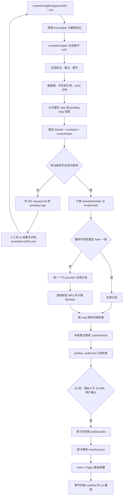

# 第 81–108 回 AI 有声书架构

## 1. 范围与发布原则

本阶段只处理第 81–108 回。音频在本地预合成，网站只播放静态 MP3，不在浏览器请求期间调用 TTS，也不需要后端或服务密钥。

- 默认 TTS provider 为 Edge-TTS；provider 契约允许以后接入 Azure 或阿里云。
- 第 81 回是 Cloudflare Pages 试点，可发布女、男两条旁白音轨。
- 第 82–108 回可以在本地生成与试听，但不在发布白名单中。
- 第 1–80 回不生成音频，也不会显示播放器。
- 生成与发布分开；`generate_audio.bat` 永远不会写入 `public/audio/`。
- 当前不依赖 R2，也不修改现有 Cloudflare Pages 构建或定时构建流程。

仓库目前没有根目录 `SPEC.md`。正文标记行为以 `src/lib/chapters/compiler.ts` 及其测试为准。

## 2. 完整链路



### AST 分块与过滤

| 来源 | 语音块分类 | 处理 |
| --- | --- | --- |
| `[T]` 标题 | `narration` | 去标记，保留标题文字 |
| 普通段落 | `narration` | 每个源段落建立基础块 |
| 外层中文引号 `“……”` | `dialogue` | 去掉外层引号，与同段旁白分开 |
| `[sc]`、`[fu]` | `poetry` | 去标记，保留诗词正文和内部换行 |
| `[B]` 等视觉标记 | 继承所在块 | 去标记，保留内部正文 |
| `[zp]`、`[mp]`、`[zpsc]` | 不生成 | 连内容一起丢弃 |
| `[wz]` / `[wz数字]`、`[img]` | 不生成 | 尾注、图片及图注不朗读 |
| 遗留 `【……】` 夹批 | 不生成 | 作为兼容规则连内容删除 |

分块器严格检查中文外层双引号；单段中存在未配对或错误嵌套时会在联网前停止，避免旁白与人物串音。

## 3. 稳定身份与增量更新

每个块有永久 ID，例如 `081-b0042`。ID 不包含文字 hash，因此在段落前插入新内容或小幅修改原文时，已有块仍能保留身份；完全相同的重复短句不会被错误合并为同一个块。

| 字段 | 含义 | 变化后的效果 |
| --- | --- | --- |
| `blockId` | 块的永久身份 | 尽量保持不变 |
| `textHash` | 实际朗读文字 SHA-256 | 正文变化时改变 |
| `contextHash` | 相邻块类型与文字 hash | 对话前后文变化时改变 |
| `annotationHash` | 会影响声音的语义标注 hash | 情感、说话人、韵律等变化时改变 |
| `renderHash` | 文字、标注、音色卡、provider 参数的合成键 | 只有声音结果可能变化时改变 |
| `fileHash` | 已生成 MP3 的实际 SHA-256 | 检测缓存损坏或错配 |

对旧块与新块先做顺序匹配，再做唯一精确匹配和保守的模糊身份匹配。标注继承规则为：

- 旁白文字变化率 `< 30%`：可自动继承旧标注。
- 对话文字变化率 `< 10%`，且上下文和关键语气标点没有风险：可自动继承。
- 诗词只要文字变化：必须重新标注。
- 新块、超阈值变化、对话上下文变化或缺少标注：写入 AI 请求并停止。
- 停止时保留已公开音频和已提交 map，不调用 TTS。

`contentHash` 在本实现中对应 `textHash`；另记录 `sourceSpeechHash` 表示整回有序朗读文本的 hash。

## 4. 标注文件

标注存放在：

```text
content/audio/annotations/081.json
```

结构示例：

```json
{
  "version": 1,
  "chapter": "081",
  "annotations": {
    "081-b0042": {
      "textHash": "<hash>",
      "contextHash": "<hash>",
      "speakerRef": "jia-baoyu",
      "emotion": {
        "family": "anger",
        "variant": "sullen-anger",
        "intensity": 2
      },
      "pace": "urgent",
      "pitch": "medium",
      "energy": "heavy",
      "timbre": ["firm"],
      "modifiers": [],
      "reviewStatus": "ai-reviewed",
      "confidence": 0.9,
      "note": "愠怒而克制"
    }
  },
  "annotationSetHash": "<所有标注的稳定 hash>"
}
```

`speakerRef` 为 `$narrator` 时，女轨使用 `zh-CN-XiaoxiaoNeural`，男轨使用 `narrator` 音色卡。人物对话引用 `content/audio/voice-cards/` 中的卡片，所以相同人物片段可在男女整轨间共享缓存。

情绪、语速、音高、力度、音质与“哭腔、冷笑、梦中呓语”等修饰会进入 `annotationHash`。Edge-TTS 对其中一部分只能用 rate、pitch、volume 近似表达；语义仍完整保存，供以后更强的 provider 使用。

## 5. TTS 抽象层

生成器只调用统一契约：

```js
const provider = await createTtsProvider(providerName, options);
await provider.synthesizeToFile({
  segments: [{ text, voice, rate, pitch, volume }],
  outputPath,
  onProgress,
});
```

主要文件：

```text
scripts/audio/generate_audio.js       分块、标注门禁、缓存与整轨编排
scripts/audio/render-plan.js          标注 + 音色卡 -> provider 参数与 renderHash
scripts/audio/track.js                MP3 校验、片段缓存和整轨拼接
scripts/audio/tts/provider.js         provider 工厂与统一入口
scripts/audio/tts/providers/edge.js   Edge-TTS 适配器
scripts/audio/tts/edge-client.js      Edge WebSocket 客户端
```

接入 Azure 或阿里云只需新增 provider 适配器、在工厂注册，并通过 `TTS_PROVIDER` 选择。分块、标注、map、缓存、BAT 和播放器都不需要改变。云服务凭据只能从环境变量读取。

## 6. 本地文件与缓存

```text
content/audio/config.json                 回目范围、双旁白和发布白名单
content/audio/annotations/081.json        可提交的语义标注
content/audio/maps/081.json               可提交的稳定顺序、hash 与输出记录
content/audio/.cache/pending/081.json      标注完成前的稳定 ID 草稿
content/audio/.cache/fragments/...         按 renderHash 寻址的 MP3 片段
content/audio/.cache/tracks/081/...        男女完整音轨
research/drafts/audio-annotations/081.request.md
```

整个 `content/audio/.cache/` 已加入 `.gitignore`。它是可重建的本机缓存，不提交 Git。`research/` 是独立私有仓库；生成标注任务前必须先将它克隆到项目根目录，避免任务文件落入未备份目录。标注和正式 map 应提交，以便正文不变时实现零次 Edge 调用。

整轨使用片段的有序 `renderHash` 列表计算 `trackHash`。只改一个块时，只合成该块的新片段，再用其余缓存片段机械拼接两条完整音轨。

## 7. Pages 发布与 manifest

第一阶段只允许第 81 回。发布目录只保留 manifest 实际引用的文件；当前试播清单仅含女声，男声通过发布检查后才会加入：

```text
public/audio/081.mp3         女旁白，默认
public/audio/081-male.mp3    男旁白
public/audio/manifest.json
```

`publish_audio.bat` 先执行只读检查，显示每轨大小、时长和 hash。任一文件损坏、与 map 不符或达到/超过 25 MiB 时禁止发布。确认后，两个 MP3 与清单以带回滚的原子替换方式安装。

清单格式：

```json
{
  "version": 2,
  "chapters": {
    "081": {
      "defaultVariant": "female",
      "variants": {
        "female": {
          "url": "/audio/081.mp3",
          "trackHash": "<hash>"
        },
        "male": {
          "url": "/audio/081-male.mp3",
          "trackHash": "<hash>"
        }
      }
    }
  }
}
```

章节页只按 `entry.data.order` 查找 manifest，并读取所选 variant 的 `url`；没有清单记录的回目不渲染播放器。`preload="metadata"` 避免打开页面时下载整轨。红楼梦与癸酉本各自保存独立阅读设置，音频旁白选择也互不影响；初始默认均为女声。

## 8. 日常工作流

首次安装：

```sh
npm install
```

生成或更新：

1. 双击 `generate_audio.bat`，输入 `81` 或 `081`。
2. 若脚本输出 `research/drafts/audio-annotations/081.request.md`，把任务交给 AI，将结果合并到 `content/audio/annotations/081.json`。
3. 再次运行 BAT。它只合成 `renderHash` 变化或缓存缺失的片段，并在本地生成男女整轨。
4. 本地试听后双击 `publish_audio.bat`。
5. 查看只读检查结果，输入 `Y` 才会发布第 81 回。
6. 正常提交仓库，由既有 Pages 构建流程部署。

终端等价命令：

```sh
npm run audio:generate -- 81
npm run audio:publish -- 81 --check
npm run audio:publish -- 81 --yes
```

## 9. 将来迁移到 R2

本地生成器保持不变。新增 R2 发布器，把整轨上传到带 `trackHash` 的版本化对象路径，然后只把 manifest 中的 `url` 改成完整 CDN URL，例如：

```text
https://audio.example.com/guiyou/081/female/<trackHash>.mp3
https://audio.example.com/guiyou/081/male/<trackHash>.mp3
```

验证远端音频可播放后，再从 `public/audio/` 移除大型 MP3。播放器不判断 URL 来自 Pages 还是 R2，因此章节页面、阅读设置、标注文件、map 和正文都无需迁移。
